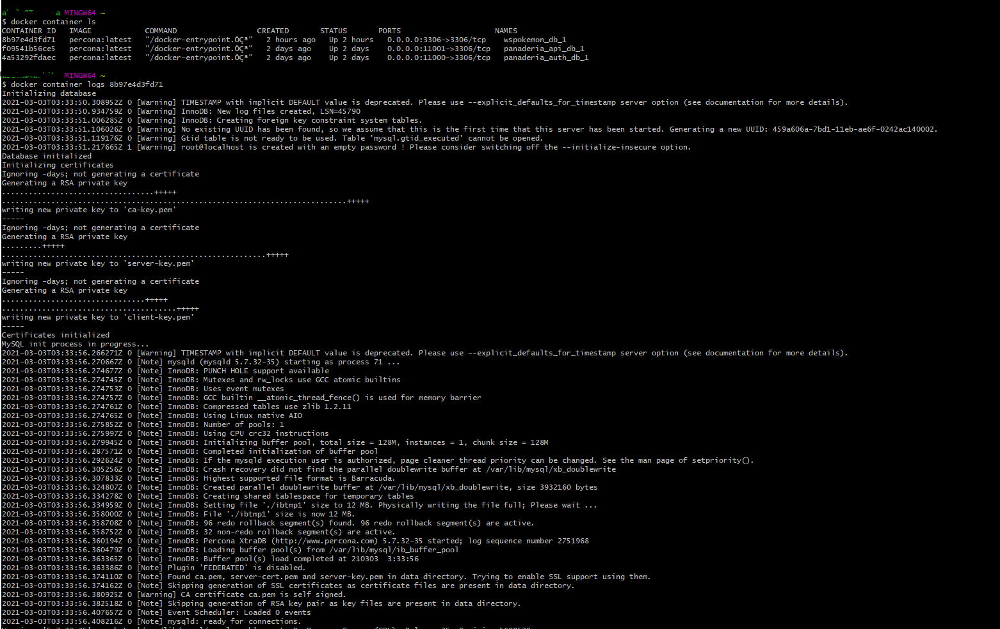
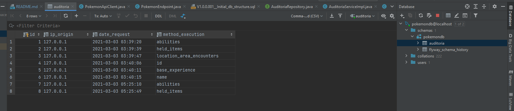
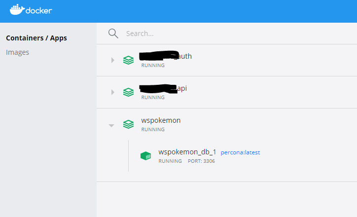
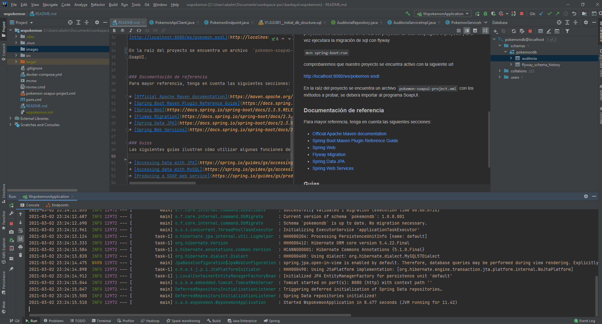
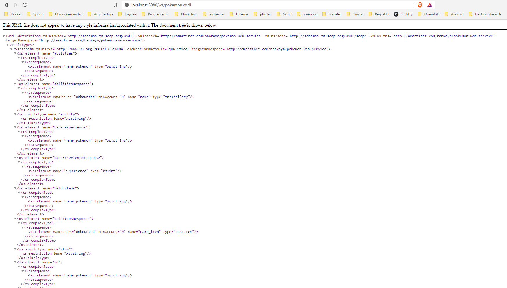
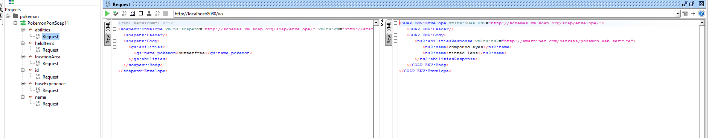
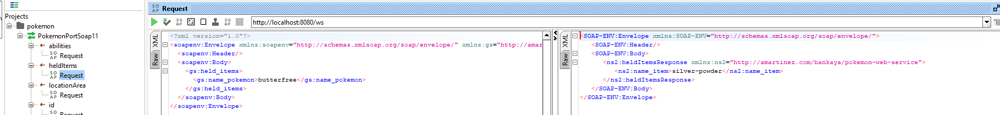

# wspokemon

Proyecto en la cual se expone servicios SOAP con spring web service. 
Se consumen servicios rest con rest template, además se usa flyway para el 
versionamiento de base de datos.

### Instalación del proyecto
Antes de instalar el proyecto, se debera tener los siguientes programas previamente instalados

* [Java JDK 8](https://docs.oracle.com/javase/8/docs/technotes/guides/install/install_overview.html)
* [Maven](https://maven.apache.org/install.html)
* [Docker](https://docs.docker.com/desktop/)
* [SoapUI](https://www.soapui.org/downloads/soapui/)

Crearemos la base datos, ingresamos a la raíz del proyecto y ejecutamos

`docker-compose up -d`

Revisamos que nuestro contenedor con la base de datos sea creado.

`docker container ls` de aqui obtenemos el `CONTAINER ID` de nuestro contenedor donde se encuentra la base de datos.

`docker container logs <CONTAINER ID>` asi vemos el estatus de la base de datos.

Una ves comprobado que la base de datos se encuentra activa, ejecutaremos el proyecto, nos ubicaremos en la raíz del proyecto.
Lo cual desplegara el proyecto y a la vez ejecutara la migración de sql con flyway 

`mvn spring-boot:run`

Comprobaremos que nuestro proyecto se encuentra activo con la siguiente url

[http://localhost:8080/ws/pokemon.wsdl](http://localhost:8080/ws/pokemon.wsdl)

En la raíz del proyecto se encuentra un archivo  `pokemon-soapui-project.xml` con los métodos a probar, se debera importar al programa 
SoapUI.

### Documentación de referencia
Para mayor referencia, tenga en cuenta las siguientes secciones:

* [Official Apache Maven documentation](https://maven.apache.org/guides/index.html)
* [Spring Boot Maven Plugin Reference Guide](https://docs.spring.io/spring-boot/docs/2.3.5.RELEASE/maven-plugin/reference/html/)
* [Spring Web](https://docs.spring.io/spring-boot/docs/2.3.5.RELEASE/reference/htmlsingle/#boot-features-developing-web-applications)
* [Flyway Migration](https://docs.spring.io/spring-boot/docs/2.3.5.RELEASE/reference/htmlsingle/#howto-execute-flyway-database-migrations-on-startup)
* [Spring Data JPA](https://docs.spring.io/spring-boot/docs/2.3.5.RELEASE/reference/htmlsingle/#boot-features-jpa-and-spring-data)
* [Spring Web Services](https://docs.spring.io/spring-boot/docs/2.3.5.RELEASE/reference/htmlsingle/#boot-features-webservices)

### Guías
Las siguientes guías ilustran cómo utilizar algunas funciones de forma concreta:

* [Accessing Data with JPA](https://spring.io/guides/gs/accessing-data-jpa/)
* [Accessing data with MySQL](https://spring.io/guides/gs/accessing-data-mysql/)
* [Producing a SOAP web service](https://spring.io/guides/gs/producing-web-service/)

